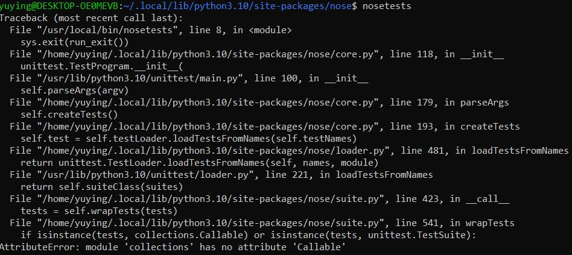
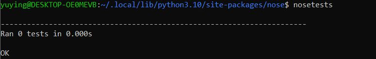

# INSTALL NOSE on Ubuntu

## Why to edit this note?

I edit this note because I meet two problems when I run Nose with git bash or Ubuntu for the first time.

After installing nose by running `pip install nose` , I run `nosetests` or `nosetests --version `, and bash returns `bash: nosetests: command not found`. It seems that the installation failed. Ubuntu also return the same error.

This note also includes the other problem `Attribute Error` when I running `nosetests` after that Ubuntu can locate Nose.

## How to solve the two problems

I try to install Nose on Ubuntu without special reason. 

### Installation

- run `sudo pip install nose` to install Nose

### Locate Nose we installing

- run `sudo pip install nose` again. 
  - In my case, I get `Requirement already satisfied: nose in /usr/local/lib/python3.10/dist-packages (1.3.7)`. 
  -  `/usr/local/lib/python3.10` is the installation path.
- Navigate to the installation path
  - In my case, I run  `cd /usr/local/lib/python3.10`.
- Run `ls` to list what we have in this directory
  - In my case, I have got `nose` and `nose-1.3.7.dist-info`
- Run `cp nose /usr/local/bin` [*[source]*](https://www.cnblogs.com/meina/p/13570416.html)
  - Thus, Nose can be found.

### AttributeError

- Run `nosetests`
  - We might meet another problem  `AttributeError: module 'collections' has no attribute 'Callable'`

    

  - We can see the error is in suite.py.

- Run `cd nose`

- Run `nano suite.py` or `sudo nano suite.py`

- Type `ctrl` + `/` to replace all `collections.Callable` to `collections.abc.Callable` [*[source]*](https://stackoverflow.com/questions/69515086/error-attributeerror-collections-has-no-attribute-callable-using-beautifu)

- Type `ctrl` +`x` and type `y` to save the change

- Type `Enter` to save the file name

- Run `nosetests`

  - It is OK.
	

